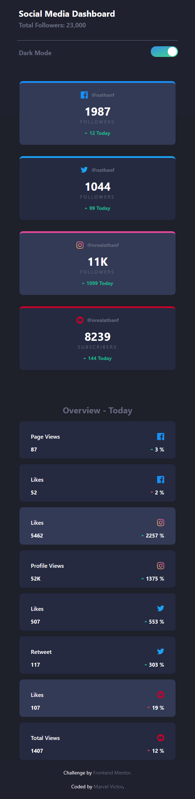

# Frontend Mentor - Social media dashboard with theme switcher solution

This is a solution to the [Social media dashboard with theme switcher challenge on Frontend Mentor](https://www.frontendmentor.io/challenges/social-media-dashboard-with-theme-switcher-6oY8ozp_H). Frontend Mentor challenges help you improve your coding skills by building realistic projects.

## Table of contents

-   [Overview](#overview)
    -   [The challenge](#the-challenge)
    -   [Screenshot](#screenshot)
    -   [Links](#links)
-   [## Available Scripts](#available-scripts)
-   [My process](#my-process)
    -   [Built with](#built-with)
    -   [What I learned](#what-i-learned)
    -   [Continued development](#continued-development)
    -   [Useful resources](#useful-resources)
-   [Author](#author)

## Overview

### The challenge

Users should be able to:

-   View the optimal layout for the site depending on their device's screen size
-   See hover states for all interactive elements on the page
-   Toggle color theme to their preference

### Screenshot

-   Desktop Solution View
    

-   Mobile Solution View
    

### Links

-   Frontend Mentor Solution URL: [Frontend Mentor Solution Page](https://www.frontendmentor.io/solutions/social-media-dashboard-with-dark-theme-react-and-sass-QZ2HU0NE7v)
-   Live Site URL: [Live Hosted Website](https://sm-dashboard-project.netlify.app/)
-   Github Solution URL: [Github Hosted Codes](https://github.com/Mharvel13/social-media-dashboard)

## Available Scripts

This project was bootstrapped with [Create React App](https://github.com/facebook/create-react-app).

In the project directory, you can run:

### `npm start`

Runs the app in the development mode.\
Open [http://localhost:3000](http://localhost:3000) to view it in your browser.

The page will reload when you make changes.\
You may also see any lint errors in the console.

## My process

### Built with

-   Semantic HTML5 markup
-   CSS custom properties
-   Flexbox
-   CSS Grid
-   Mobile-first workflow
-   [React](https://reactjs.org/) - JS library
-   SASS - CSS Preprocessor libary

### What I learned

#### Introduction to React and Components

Learning React has been intresting and exciting and it's necessary to practice the concepts. The use of Components, Props and State was implemented in the course of this project.

I implemented the use ofconditional rendering in classnames to toogle the dark mode functionality.

```jsx
  <header className={`header  ${props.darkMode ? "dark-bg-top" : " "}`}>

```

At the end of it all, its a good practice project and useful in solidifying knowledge in React Concepts

### Continued development

This project can be developed to pull actual data from various social media accounts and useful in tracking activities and progress in these applications
It could be a project that incoperates backend technologies and API usage.

## Author

-   GitHub Profile - [Mharvel13](https://github.com/Mharvel13)
-   Frontend Mentor Profile - [Marvel Victor](https://www.frontendmentor.io/profile/Mharvel13)
-   Twitter - [Marvel](https://twitter.com/Mharvel_O)
